# 第3回授業課題

## 【課題内容】
- サンプルアプリケーションのデプロイ
- APサーバーについて調べる
- DBサーバーについて調べる

<br>

### サンプルアプリケーションのデプロイ
***
- ブラウザでのアクセスに成功

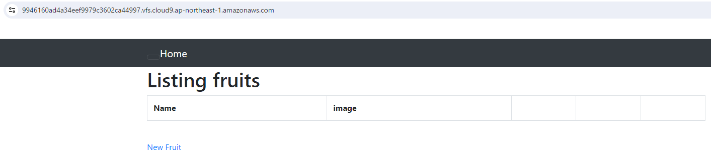

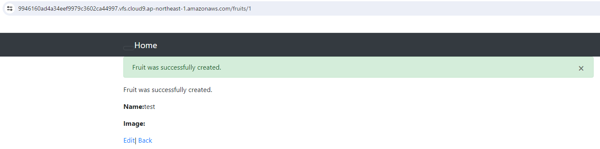

<br>
<br>

### 実際に行った手順＆学んだこと
***
```sh
# Rubyのバージョン確認
ruby -v

# Rubyのコマンド一覧
ruby -h
ruby --help

# Ruby Version Managerのバージョン確認
rvm install -v
```
- **RVM**（Ruby Version Manager）とは
     - 同じデバイスに複数インストールされたRubyを管理するよう設計されたオペレーティングシステム

<br>

```sh
# 指定されたRubyのバージョンをインストール
rvm install 3.1.2

# 使用したいバージョンへの切替
rvm use 3.1.2

# インストールされているRubyと、どのバージョンが適用されているかの確認
rvm list
```
- **ruby-3.1.2**が適用されていることがわかる

  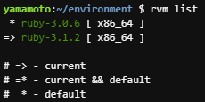
   
<br>

```sh
# 未使用データの削除《容量の確保》
docker system prune -a
```
- **Are you sure you want to continue? [y/n]** の横に`y（yesの意）`を入力
   - **Docker**とは
     - ひとつのOSに対して多数のアプリケーション実行環境（開発環境）を構築可能
     - AWSではDockerのオープンソリューションと商用ソリューションの両方がサポートされている

<br>

```sh
# MariaDBを削除してMySQL8.0をインストール
curl -fsSL https://raw.githubusercontent.com/MasatoshiMizumoto/raisetech_documents/main/aws/scripts/mysql_amazon_linux_2.sh | sh
```
- **Curlコマンド**とは
  - 様々なオプションを指定することで、データ取得時の条件や、取得する情報を変えることが出来る
- **MySQL**とは
  - Webアプリケーション開発でよく使われるデータベースシステム

<br>

```sh
# MySQLの初期パスワードを確認
sudo cat /var/log/mysqld.log | grep "temporary password" | awk '{print $13}'
```
- **sudoコマンド**とは
  - 一般ユーザーがソフトをインストールしたり、ソフトを実行したりする場合、Linuxではsudoを一番始めに宣言して使用する
  - 宣言することで管理者権限で実行することが可能となる

<br>

```sh
# MySQLにログイン（Enter passwordに初期パスワードを入力）
mysql -u root -p

# 初期パスワードの変更
ALTER USER 'root'@'localhost' IDENTIFIED BY '設定するパスワード';

# パスワードの変更を有効にする
FLUSH PRIVILEGES;

# MySQLからログアウト
exit

# 再度MySQLへログイン
mysql -u root -p

# パスワードの変更が適用されていることを確認してログアウト
exit

# MySQLコマンドキャンセル
\c
```

<br>

```sh
# ディレクトリの移動
cd raisetech-live8-sample-app

# database.yml.sampleファイルのコピー
cd config/database.yml.sample config/database.yml
```
- `config`フォルダ内の`database.yml.sample`ファイルが、`config`フォルダ内に`database.yml`というファイル名でコピーされる
   - **YML**とは
     - YAML Ain’t Markup Languageの略称
     - XMLやJSONのような人間が読めるデータシリアライズ言語のひとつ
     - 他の言語と比較しても軽量で比較的わかりやすいため、読みやすいとされている
- コピーしたファイル内にある「password」欄に設定した新しいパスワードを入力する

<br>

```sh
# MySQLの設定
cat /etc/my.cnf
```
- `/etc/my.cnf`はグローバルオプションファイル
- **catコマンド**とは
  - 「連結する」を意味するconcatenateが名前の由来
  - ファイルの内容を連結して標準出力に出力するコマンド
  - 単一のファイル内容を表示するために使用されることが多い

<br>

- 表示されたファイル内にある`socket=/var/lib/mysql/mysql.sock`のスラッシュ以下をコピーし、database.ymlファイル内にある`socket`の内容を書き換える（2箇所）
  - **socket**とは
    - プログラムとネットワークをつなげる接続口のこと

<br>

```sh
# 環境構築
bin/setup
```
- バージョン`2.3.14`の**Bundler**がインストールされていることが確認できる
  - **Bundler**とは
    - gemのバージョン管理やgemの依存関係を管理してくれるgemのこと
  - **gem**とは
    - gem形式にパッケージングされたRuby言語用の外部ライブラリ
  - **ライブラリ**とは
    - 汎用性の高い機能を他のプログラムで呼び出して使えるように部品化して集めたファイルのこと

<br>

```sh
# Nodeのバージョン確認
node -v

# 指定のバージョンをインストール
nvm install 17.9.1

# 使用するバージョンの切替
nvm use 17.9.1
```
- **NVM**（Node Version Manager）とは
  - Node.jsのバージョン管理を行うためのソフトウェアツール
- **Node.js**とは
  - JavaScriptをサーバー側で動作させるプラットフォーム
    
<br>

```sh
# yarnをインストール
npm install -g yarn
```
- **NPM**（Node Package Manager）とは
  - 主にJavaScriptで開発されたプラグラム部品（モジュール）を管理するためのパッケージ管理システムの一つ
- **Yarn**とは
  - JavaScriptをサーバーサイドで動かすための実行エンジンである「Node.js」上で動作するパッケージマネージャーの一つ
  - npmより高速で、並列インストールをサポートし、パッケージのインストール速度を向上させる
- `npm install -g yarn`の「**-g**」
  - インストール先がグローバル。デフォルトはローカル
  - rootが所有する{prefix}/lib/node_modules/にパッケージがインストールされる

<br>

```sh
# yarnのバージョン確認
yarn -v

# もう一度環境構築
bin/setup

# アプリケーションの起動
bin/cloud9_dev
```
**⇒ アクセスの権限がない（実行ができない）ため拒否される**

<br>

```sh
# binディレクトリ内すべてのファイルやディレクトリを詳細な情報と共に表示し、隠しファイルも含めて表示
ls -la bin
```
- パーミッション情報を確認する
- cloud9_devは`-rw-rw-r--`となっており、アクセス権限がないことがわかる
- パーミッション情報は、1桁目がファイル情報で、「d」であればディレクトリ、「-」であればファイルを意味する
- 1桁目以降は、3文字1セットで、左から「所有者」「グループ」「その他のユーザー」を表す
- パーミッションの有効無効は0～7の数値で表す  
    
  | アクセス権 | 数値| 説明 |
  |:---|:---|:---|
  | --- | 0 | 読み込み書き込み不可 |
  | --x | 1 | 実行のみ |
  | -w- | 2 | 書き込みのみ |
  | -wx | 3 | 書き込み実行のみ |
  | r-- | 4 | 読み込みのみ |
  | r-x | 5 | 読み込み実行のみ |
  | rw- | 6 | 読み込み書き込みのみ |
  | rwx | 7 | 読み込み書き込み実行ができる |

<br>

```sh
# cloud9_devのアクセス権限を変更
sudo chmod 775 bin/cloud9_dev

# 権限が変更されているかを確認
ls -la bin
```
- `-rwxr-xr-x`となっていた為、「755」で変更が適用されていることがわかる

<br>

```sh
# 再度アプリケーションを起動
bin/cloud9_dev
```
**⇒ Block hostと表示された為、`Ctrl＋C`でアプリケーションを停止する**

<br>

- configフォルダ ⇒ environmentsフォルダ内にある**development.rb**ファイルを開く
-  Block hostの画面に表示されている文字列をdevelopment.rbファイルの一番下にペーストする

   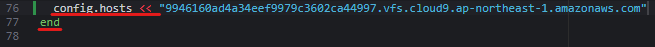

- `config.hosts <<`も入力しなければ起動しない
- `end`がきちんと反映されていないと起動しない ⇒ `syntax error`が表示された
- `bin/cloud9_dev`で再度アプリケーションの起動をする
   - 起動に成功
   - 動作確認も完了

<br>
<br>

### APサーバーについて調べる
***
- Railsを動かすためのサーバー（Railsのバージョンは**7.0.4**）
- **Puma version 5.6.5**を使用
   
  

<br>

- サーバーを`Ctrl＋C`で停止させた後、引き続きアクセスは出来ない
   
  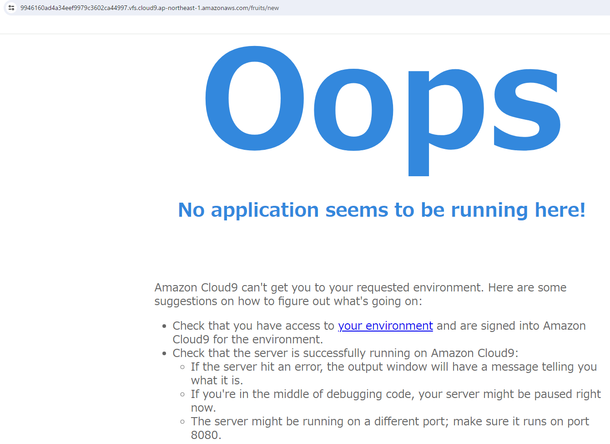
- `rails s`でアプリケーションサーバーを再起動すると再びアクセスが可能

<br>
<br>

### DBサーバーについて調べる
***
- **MySQL version 8.0.35**を使用
- バージョンの確認はMySQLログイン時、またはログインしてからのコマンドで確認が出来る
 
   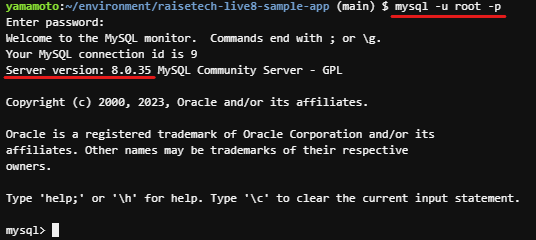

   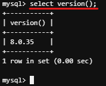

<br>

 - サーバーを終了させた後、`rails s`を入力しても引き続きアクセスは出来ない
 
   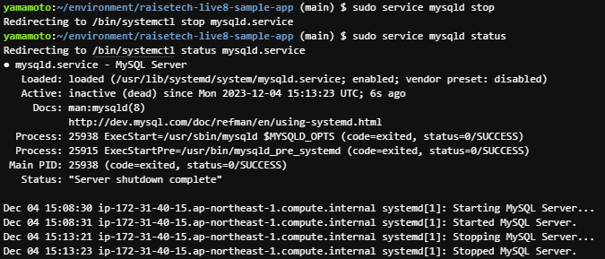

   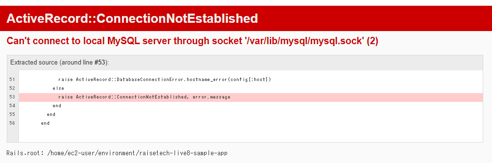

<br>

- 再起動をすると`active（running）`になりアクセスが可能になる
 
   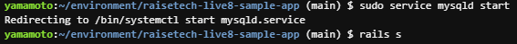

   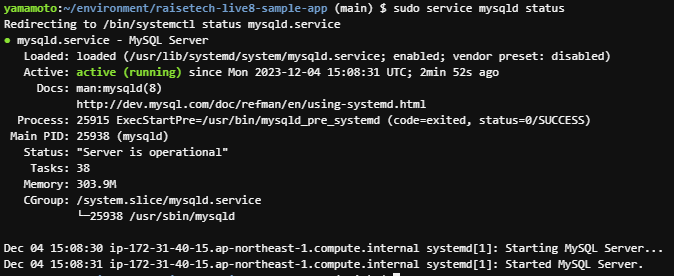

<br>
<br>

## 【所感】
工程が上手く理解できず、課題を進めるのに非常に時間が掛かった。<br>それぞれが互いにどのように作用しているか等、一度実践しただけではわからなかった。<br>今回こうして作業内容を整理し直すことで、それでもまだ不十分であるとは思うが、理解に繋がったように思う。<br>「簡単なアプリケーション」と聞いていたが、起動時の動作が単純なアプリケーションでも初学者の自分には複雑だった。<br>実際の業務となると、もっと難解な作業になるのだろうがまったく想像がつかない。<br>これからも根気よく理解を深めていきたい。