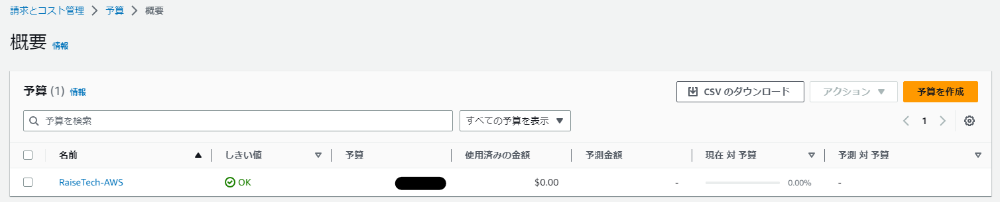
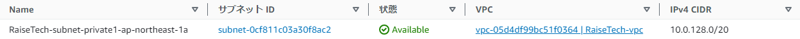

# 第4回授業課題

## 【課題内容】
- VPC作成
- EC2とRDSの構築
- EC2からRDSへの接続

<br>
<br>

### コスト管理
***

- VPC作成前に、コストを管理する為に閾値の設定を行った
  - 通知が来るように設定を行っている

<br>
<br>

### VPC作成
***


<br>
<br>

### EC2
***


<br>
<br>

### RDS
***
- 1回目の課題提出時、サブネットグループがデフォルトになっていた
  - パブリックサブネットとプライベートサブネットが混在している状態
  - インターネットでアクセスできないプライベートサブネットに設定するのがマスト

#### 修正前


<br>

#### 修正後


<br>

#### 作成したサブネットグループ


<br>

- どちらもプライベートサブネットを選択

  

  

<br>
<br>

### セキュリティーグループ
***
#### EC2

#### RDS


<br>
<br>

### EC2へのSSH接続
***

- TeraTermを使用してアクセス

<br>
<br>

### EC2からRDSへの接続
***
- `sudo yum install mysql`コマンドにてEC2にMySQLをインストール

  

- 下記を入力
```sh
  mysql -u ユーザー名 -p -h データベースのエンドポイント
```
- 続けてパスワードを入力すると接続できる

  

<br>

- **作成し直したRDSにも接続できることを確認**

  

<br>
<br>

## 【所感】
ES2にMySQLがインストールできず、解決するのに4時間ほどかかってしまった。


EC2作成時に誤ってLinux 2023を選択してしまっており、SSH接続時の画面で気づくべきだった。<br>
再度Linux 2でインスタンスを作成し直すとすんなり接続することが出来て拍子抜けしてしまったが、「Linux 2023だから接続が出来ないのではないか？」と自力で気付くことができ、解決に至ったのはとても嬉しい。<br>
同じLinuxでも、種類によって使えないコマンドがあるのだと勉強になった。<br>
現在は無料利用枠を使用しているが、サービスへの理解を深めることがコスト管理にも繋がると感じた。<br>
今後もサービスに関する学習を続けていきたい。