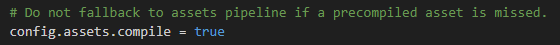
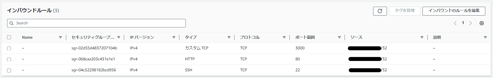
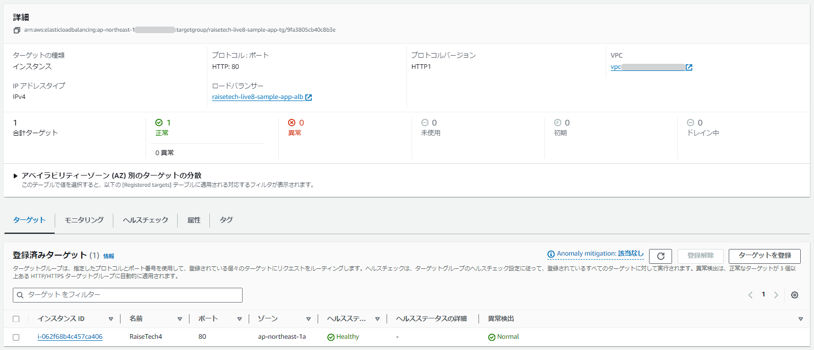
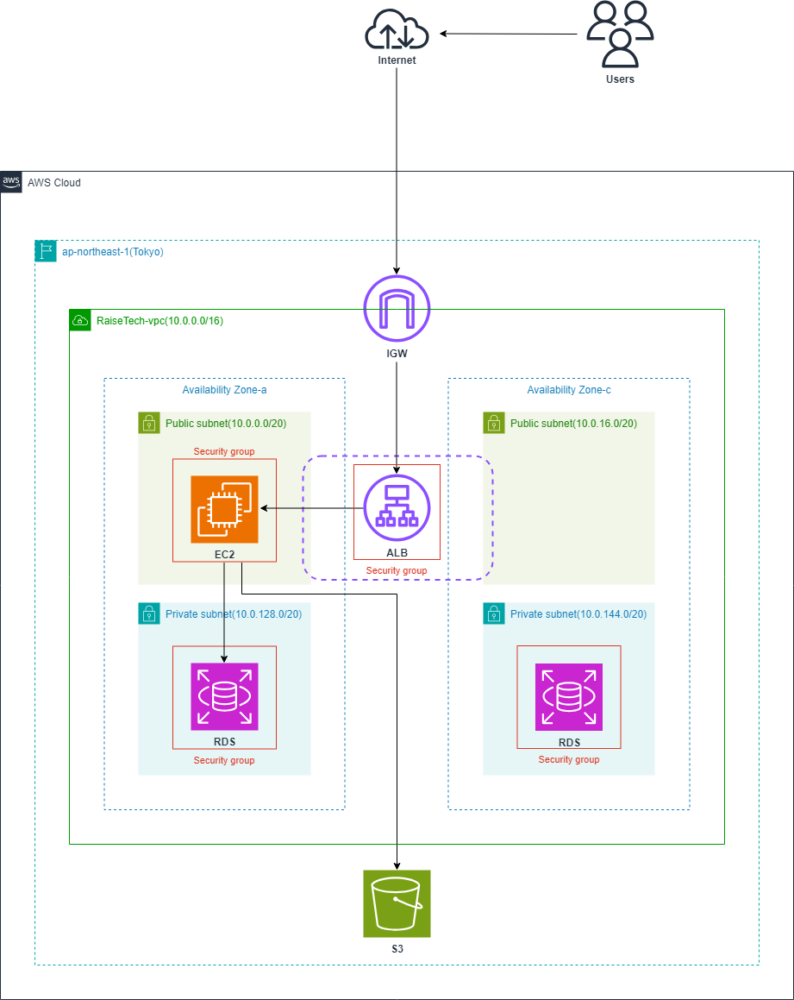

# 第5回授業課題

## 【課題内容】
- EC2上にサンプルアプリケーションをデプロイ　**〈組み込みサーバー〉**
- 個別サーバーでのデプロイ　**〈Webサーバー：Nginx〉**　**〈APサーバー：Unicorn〉**
- ELB（ALB）の追加
- S3の追加
- AWS構成図の作成

<br>
<br>

### EC2上にサンプルアプリケーションをデプロイする
***
#### 1. EC2へのSSH接続は下記サイトを参考に行った
- [VScodeからEC2へSSH接続](https://kyrieee.com/vscode-ec2-ssh/2121/)
- [windows環境の「visual studio code」から「Remote SSH」でサーバーにつなぐためのtips](https://note.com/existy/n/n2c1ba091f02a)
- 「**Identityファイルをユーザードキュメント配下に置く**」という言葉の意味がわからず苦戦したが、接続に成功

  
  

<br>

#### 2. EC2に必要なものを順次インストールする

〈参考サイト〉
- [AWS EC2 AmazonLinux2 Gitをインストールする](https://qiita.com/miriwo/items/8d5b35950232c1126d36)
- [EC2＋RDSでrailsの環境構築](https://qiita.com/tkym_0122/items/7da5d05b5cd1474ec41b)
- [RVMのインストール方法と使い方](https://tuuuti.hatenablog.com/entry/rvm_install)
- [Linuxにnvmを使用してNode.jsをインストールする](https://qiita.com/rockhopper-penguin/items/3a53da9b08fb4b9b1947)
- [Amazon linux2で npmを利用する方法](https://zenn.dev/hikary/articles/6f2d7a174de7ff)
- [【初心者向け】RDSを立ち上げてEC2につなげてあげよう!【AWS】](https://n2p.co.jp/blog/tech/rds/)
- [AWS EC2 | Ruby on Rails インストール手順](https://prettytabby.com/ec2-ruby-install/)
- [【ubuntu】nvmでnodeのバージョンごとにyarnをインストール、アンインストール](https://im0039kp.jp/%E3%80%90ubuntu%E3%80%91nvm%E3%81%A7node%E3%81%AE%E3%83%90%E3%83%BC%E3%82%B8%E3%83%A7%E3%83%B3%E3%81%94%E3%81%A8%E3%81%AByarn%E3%82%92%E3%82%A4%E3%83%B3%E3%82%B9%E3%83%88%E3%83%BC%E3%83%AB%E3%80%81/)
- [gnomeの端末でrvmでuseできなかった場合](http://blog.mwsoft.jp/article/176814376.html)
- [Ruby | bundler を特定のバージョンに切り替えて実行する](https://qiita.com/YumaInaura/items/64e5721549e4927ce85f)
- [EC2(Amazon Linux)にrvmでRuby環境を構築する](https://giiko.hatenadiary.com/entry/2014/12/14/194350)
- [MySQLサーバーの起動と停止コマンドまとめ（起動確認や再起動の方法も）](https://26gram.com/start-stop-mysql)
- [AWS EC2 AmazonLinux2 MySQLをインストールする](https://qiita.com/miriwo/items/eb09c065ee9bb7e8fe06)

```sh
# パッケージの最新化
sudo yum update

# タイムゾーンの設定
sudo timedatectl set-timezone Asia/Tokyo

# gitのインストール
sudo yum install git

# gitのバージョン確認(2.40.1)
git version

# サンプルアプリケーションのクローンを作成
git clone https://github.com/yuta-ushijima/raisetech-live8-sample-app.git

# railsに必要なパッケージのインストール
sudo yum  -y install git make gcc-c++ patch libyaml-devel libffi-devel libicu-devel zlib-devel readline-devel libxml2-devel libxslt-devel ImageMagick ImageMagick-devel openssl-devel libcurl libcurl-devel curl

# RVMのインストール
curl -L get.rvm.io | bash -s stable

gpg2 --keyserver hkp://keyserver.ubuntu.com --recv-keys 409B6B1796C275462A1703113804BB82D39DC0E3 7D2BAF1CF37B13E2069D6956105BD0E739499BDB

curl -sSL https://rvm.io/mpapis.asc | gpg2 --import -
curl -sSL https://rvm.io/pkuczynski.asc | gpg2 --import -

\curl -sSL https://get.rvm.io | bash -s stable

# Rubyのインストール
rvm install "ruby-3.1.2"
source /home/ec2-user/.rvm/scripts/rvm
rvm use --default 3.1.2
rvm rubygems latest
source ~/.bash_profile
ruby -v

# NVMとNode.jsのインストール
curl -o- https://raw.githubusercontent.com/nvm-sh/nvm/v0.39.7/install.sh | bash

. ~/.nvm/nvm.sh

nvm install 17.9.1
node -v

# Yarnのインストール
npm install -g yarn@1.22.19
yarn -v

# Bundlerのインストール
gem install bundler -v 2.3.14
bundler -v

# インスタンス作成初期からインストールされているMariaDB用パッケージを削除
sudo yum remove -y mariadb-*

# MySQLのリポジトリをyumに追加
sudo yum localinstall -y https://dev.mysql.com/get/mysql80-community-release-el7-11.noarch.rpm

# MySQLに必要なパッケージ(mysql-community-server)を取得
sudo yum install -y --enablerepo=mysql80-community mysql-community-server

# MySQLに必要なパッケージ(mysql-community-devel)を取得
sudo yum install -y --enablerepo=mysql80-community mysql-community-devel

# インストールされたMySQLに関係のあるパッケージを出力
yum list installed | grep mysql

# logファイルを作成
sudo touch /var/log/mysqld.log

# mysqldを起動
sudo systemctl start mysqld 

# mysqldの状態確認
systemctl status mysqld.service

# mysqldがインスタンスの起動と同時に起動するように設定
sudo systemctl enable mysqld

# mysqldの停止
sudo service mysqld stop

# railsのインストール
gem install rails -v 7.0.4
bundle install
rails -v

# database.ymlの作成
cp config/database.yml.sample config/database.yml

# database.ymlの編集
username: RDSのユーザー名
password: RDSのパスワード
host: 行を追加してRDSのエンドポイント

# MySQLログイン（確認）
mysql -u ユーザー名 -p -h RDSのエンドポイント
exit

# 環境構築
bin/setup

# MySQLの起動
sudo service mysqld start
sudo service mysqld status

# MySQL確認(データベース)
mysql -u ユーザー名 -p -h RDSのエンドポイント
show databases;
exit
```

<br>

- MySQLの起動を確認

  

- `show databases;`でデータベースの存在が確認できる

  

<br>

```sh
# アプリケーションの起動
rails s

# EC2のセキュリティーグループに3000番ポートを追加

# MySQLを止める場合
sudo service mysqld stop
```

<br>

- インストールしたものに問題があったのか、VScodeがフリーズして作業がまったく進まない為、EC2を再度作成し、併せてコマンドの見直しも行ったところ、無事に必要なもののインストールが完了した
- 2つ目のEC2ではサンプルアプリケーションのデプロイが成功したが、MySQLを第3回授業課題で使用したコマンドでインストールしてしまった
- 除去方法がわからなかった為、再度EC2を作成し直した
- 3つ目のEC2では何故か下記画面が表示され、アプリケーションがデプロイ出来なかったため、「[rails6 「ActionView::Template::Error (The asset “application.css” is not present in the asset pipeline」の対処法](https://mebee.info/2021/01/19/post-27981/)」を参考にしたところ、無事デプロイに成功した

<br>


### ① プリコンパイル処理
```sh
rails tmp:cache:clear
rails assets:precompile
```

### ➁ config配下の「production.rb」を以下の通りに変更



※デフォルトでは「config.assets.compile = false」となっている

<br>

### ③ デプロイに成功


- 現状は`development.rb`の為、➁は関係ない気がする

<br>
<br>

### 個別サーバーでのデプロイ　〈Webサーバー：Nginx〉　〈APサーバー：Unicorn〉
***
〈参考サイト〉
- [Rails】 AWSのEC2にデプロイする方法~画像で丁寧に解説！](https://pikawaka.com/rails/ec2_deploy)
- [AWS(EC2)でNginxのrails.confを設定する方法](https://qiita.com/gyu_outputs/items/f816ade3eaaf68ee7f66)
- [【CentOS 7】Nginx + Unicorn で Rails アプリケーションを本番環境で立ち上げる方法](https://zenn.dev/noraworld/articles/deploy-rails-application-with-nginx-and-unicorn)
- [Rails】 AWS Rails 6 + MySQL + Nginx な環境の作成方法 サーバー編](https://takelg.com/aws_create_rails_development_server/)
- [Nginx , Unicorn , Ruby on Rails 環境での502エラー忘備録](https://zenn.dev/chikaniki2/articles/8121a3e2110ad5)
- [【vim】スワップファイル（.swp）について - 出さなくする/出力場所を設定する](https://www.tweeeety.blog/entry/2017/01/25/001208)
- [デプロイ方法⑤(Nginx/Unicorn)](https://qiita.com/maru1124_/items/88febc8ba50014056a34)
- [AWS EC2で立ち上げたRails（unicorn）サーバーのログ確認方法](https://qiita.com/jibiking/items/116b765d39c06da83970)

<br>

#### 1. Nginx（エンジンエックス）

```sh
# Nginxのインストール
sudo amazon-linux-extras install -y nginx1

# Nginxのバージョン確認
nginx -v

# Nginxの起動
sudo systemctl start nginx

# Nginxのステータス確認
sudo systemctl status nginx
```

- Nginxにアクセスしてみる
  - EC2セキュリティーグループのインバウンドルールを追加
    
    

  - `http://EC2パブリックIPv4/`でブラウザからアクセス
    
    

```sh
# Nginxの自動起動設定
sudo systemctl enable nginx

# Nginxの停止
sudo nginx -s stop

# 設定ファイルの作成
sudo vi /etc/nginx/conf.d/rails.conf

# 以下を入力
upstream unicorn {
    server  unix:/home/ec2-user/raisetech-live8-sample-app/tmp/unicorn.sock;
}

server {
    listen       80;
    server_name  EC2パブリックIPv4アドレス;

    access_log  /var/log/nginx/access.log;
    error_log   /var/log/nginx/error.log;

    root /home/ec2-user/raisetech-live8-sample-app/public;

    client_max_body_size 100m;
    error_page  404              /404.html;
    error_page  500 502 503 504  /500.html;
    try_files   $uri/index.html $uri @unicorn;

    location @unicorn {
        proxy_set_header X-Real-IP $remote_addr;
        proxy_set_header X-Forwarded-For $proxy_add_x_forwarded_for;
        proxy_set_header Host $http_host;
        proxy_pass http://unicorn;
    }
}

# Nginxの再起動
sudo systemctl restart nginx.service

# 設定ファイル構文チェック
sudo nginx -t

# 更新した設定ファイルの適用
sudo nginx -s reload

# Nginxの権限変更
cd /var/lib
sudo chmod -R 775 nginx

# Nginxの再起動
cd ~
sudo service nginx restart
```

<br>

#### 2. Unicorn

```sh
# Unicornのインストール
bundle install
※組み込みサーバーのデプロイ時点ですでに実行していた為、ここでは必要なし

# 起動・停止スクリプトの作成
rails g task unicorn
```

- `lib/tasks`ディレクトリに`unicorn.rake`というファイルが生成される
- ファイルに以下を追加する

```sh
namespace :unicorn do

  # Tasks
  desc "Start unicorn"
  task(:start) {
    config = Rails.root.join('config', 'unicorn.rb')
    sh "unicorn -c #{config} -E development -D"
  }

  desc "Stop unicorn"
  task(:stop) {
    unicorn_signal :QUIT
  }

  desc "Restart unicorn with USR2"
  task(:restart) {
    unicorn_signal :USR2
  }

  desc "Increment number of worker processes"
  task(:increment) {
    unicorn_signal :TTIN
  }

  desc "Decrement number of worker processes"
  task(:decrement) {
    unicorn_signal :TTOU
  }

  desc "Unicorn pstree (depends on pstree command)"
  task(:pstree) do
    sh "pstree '#{unicorn_pid}'"
  end

  # Helpers
  def unicorn_signal signal
    Process.kill signal, unicorn_pid
  end

  def unicorn_pid
    begin
      File.read("/home/ec2-user/raisetech-live8-sample-app/tmp/unicorn.pid").to_i
    rescue Errno::ENOENT
      raise "Unicorn does not seem to be running"
    end
  end

end
```

```sh
# Unicornの起動
rake unicorn:start

# 起動しているかどうかの確認
ps -ef | grep unicorn | grep -v grep
```

<br>

#### 3. 接続確認

```sh
# 応答があるかどうかの確認
curl http://EC2のパブリックIPv4アドレス/

# アクセスログの確認方法
sudo cat /var/log/nginx/access.log

# エラーログの確認方法
sudo cat /var/log/nginx/error.log
```
```sh
# Unicornの停止
rake unicorn:stop

# プロセス番号の確認
ps aux | grep unicorn

# unicorn.sockの削除
rm /home/ec2-user/raisetech-live8-sample-app/tmp/unicorn.sock

# プロセスのkill
kill <確認したunicorn rails masterのPID（下図では10683）>
```


<br>

#### 4. エラーの対処
***
〈参考サイト〉
- [グローバルIPをcurlで確認](https://qiita.com/kanpou0108/items/734b947f5a95109e7bb9)
- [Nginxの導入でエラーが出たので、解決した。](https://qiita.com/naomit/items/b57e6ca1e2d45195817d)
- [EC2に構築したNginx の設定を初期化する方法](https://qiita.com/YO66/items/e4d0a0ded99f5b6e88b9)
- [Nginxの設定で押さえておきたいポイント](https://www.wakuwakubank.com/posts/611-web-server-nginx/)
- [curlコマンドの使い方(HTTPリクエスト)](https://www.wakuwakubank.com/posts/800-linux-network-curl/)
- [curlでunix domain socket経由アクセスする](https://qiita.com/toritori0318/items/193df8f749a9c4bda883)
- [aws nginx + unicorn (13:permission dnined) while connecting to upstream でハマッた時に試したことのTIPS](https://qiita.com/UltraBirdTech/items/4f1a4a490cfc19298ad0)
***

<br>

- `curl http://EC2パブリックIPv4アドレス/`でNginxの初期画面がブラウザ上で表示されており、サンプルアプリケーションが機能していないことがわかった為、Unicornのログ確認を試みた

  

- 原因を探る過程で、セキュリティーグループのソースに誤りがあったために訂正をした。自分以外もアクセスできるようになっていた為、エラーログに他の通信ログも反映されていた
- ソース`0.0.0.0/0`は「すべての通信」ということになり、ポートを全開放しているわけではないが、他人でもアクセスが出来るようになってしまう

  

- ソース訂正後、VScodeから`curl http://EC2パブリックIPv4アドレス/`ではHTML等表示されなくなった
- `curl -v http://EC2パブリックIPv4アドレス/`でサーバーとのやり取りを表示させたが、接続さえできていない

  

- Nginxのconfigファイルの設定が正しいか不安だった為見直しも行った
- 「escキー→:wqエンターキーで保存」が完了するようだが、「:wq入力→escキー」としていた為、正しく反映されていなかった可能性がある
- また、誤って不要なconfigファイルを作成していた為削除を行った
- configファイル訂正後、エラーログで表示されていた`usr/share/nginx/html/favicon.ico`は表示されなくなったが、それでもブラウザが正しく表示されない

  

- unix domain socket経由で通信を試みた
- 下記を見たところ、Unicornから応答はあるため問題はNginxとUnicorn間であることが判明

  

- 上記コマンドはcurlバージョン7.40以上でないと使用できないとのことだが、確認したところバージョンは問題なかった

  

<br>

***
- 解決が難しかったため、リアルタイム授業（2024年1月6日　第1回）で講師の方に確認して頂き、アドバイスを頂いた

  
  

1. `sudo vi /etc/nginx/nginx.conf`で`nginx.conf`ファイルを開こうとしたところ、`.nginx.conf.swp`ファイルの影響で開くことができなかった為、`sudo rm /etc/nginx/.nginx.conf.swp`で削除を行った
2. `nginx.conf`ファイル内の編集を行った
   - `include /etc/nginx/conf.d/*.conf;`を`#gzip  on;`の下に追記
   - `server name`をアンダーバーに変更
   - `location`以下をコメントアウト

<br>

- 以上の変更により、下記ステータスコードが表示されるようになった

  

- 通常、configファイル内に`include /etc/nginx/conf.d/*.conf;`の記述はあるはずだが、Nginxのインストール方法が異なったのか、記述がなかったことも「Welcome to Nginx!」が表示される要因のひとつらしい
- エラーログの確認により、**ユニックスのソケットファイルに対しての読み取り権限がない**ことと、**500.htmlのアクセス権限がない**ことがステータスコード502の原因であることが判明

<br>

- まず、下図の通り「500.html」のパーミッションを変更した


**⇓ 変更**


<br>

- しかしエラーログの内容に変化が見られなかった為、NginxとUnicorn、それぞれを立ち上げているユーザーを確認したところ、Nginxのユーザーが他と異なることがわかった
- 立ち上げているユーザーが一致していなければ、Permission deniedで弾かれることがあるらしい

  

- `sudo vi /etc/nginx/nginx.conf`コマンドでファイルを開き、`#user nobody;`の下に追記

  

- Nginxを立ち上げるユーザーをUnicornと一致させた

  

- するとエラーログが`Permission denied`から`No such file or directory`に変わった

  

- さらにエラーの原因を調べたところ、とても初歩的なミスをしていることが判明した
- `sudo vi /etc/nginx/conf.d/rails.conf`の設定だが、`raisetech-live8-sample-app`がすべて`raisetech_live8_sample_app`となっていた（ハイフンがアンダーバーに）
- こちらを訂正し、再度Nginxをリスタートさせたところ、無事アプリケーション画面がブラウザ上に表示された

  

<br>
<br>

### ELB（ALB）の追加
***
〈参考サイト〉
- [【AWS】ELBの作成方法解説！ロードバランサーを構築くてWebサイトへの負荷を分散する](https://engineer-ninaritai.com/aws-elb-make/)
- [【AWS ELB】httpアクセスをロードバランシング](https://qiita.com/OPySPGcLYpJE0Tc/items/e3331567ad0c34978159)
- [(ECS,Rails6)ロードバランサー ALB と データベース RDS とECRを使ってコマンドラインから ECSにRails6のアプリをデプロイ](https://qiita.com/sibakenY/items/d81c1fa4ee1f41fee8d7)
- [【AWS】ALB(Application Load Balancer)による負荷分散作成の備忘録](https://qiita.com/grapefruit1030/items/2f97ab1736ee3f784f0e)
- [【保存版】AWS Application Load Balancer（ALB）を使ってEC2にアクセスしてみよう！](https://note.com/standenglish/n/n0bdd964c308f)
- [ALBのヘルスチェックが失敗する時の対応方法と解決策](https://cloud5.jp/alb%EF%BD%B0unhealthy/)
- [ALBのヘルスチェックに失敗するときに確認すること](https://akng-engineer.hatenablog.com/entry/2020/05/17/000706)

<br>

#### 1. ターゲットグループの作成
- 基本的な設定：インスタンス
- VPC：サンプルアプリケーションが入っているものを選択
- プロトコルバージョン：HTTP1
- ヘルスチェックプロトコル：HTTP
- ヘルスチェックパス：/
- ターゲットの登録：アプリケーションが入っているEC2を選択

<br>

#### 2. ロードバランサーの作成
- セキュリティーグループを新規作成
- ソースはマイIPアドレスを指定

  

- ネットワークマッピングは下図の通り

  

- 作成したロードバランサー

  

- `development.rb`に以下を追記
```sh
config.hosts << "ALBのDNS名"
```
- NginxとUnicornを再起動し、ブラウザからDNS名でアクセスを試みたが、ステータスコード504が表示された
- ターゲットグループのヘルスチェックも`unhealthy`となっている
- パブリックIPアドレスではアプリケーション画面が表示されたため、NginxとUnicornは問題がなさそう

  

  

- 解決方法を調べ、EC2のセキュリティーグループにALBのセキュリティーグループを追加した
- 再度NginxとUnicornの再起動を行い、DNS名でアクセスしたところ、無事アプリケーション画面が表示された
- ヘルスチェックも`Healthy`になった

  

  

  

<br>
<br>

### S3の追加
***
〈参考サイト〉
- [[Rails]Active Storageの画像をAWS S3へ保存する](https://zenn.dev/redheadchloe/articles/e924ab767b40d5)
- [AWS S3に対してデータをアップロードするためのWebページをAWS EC2上に作成する](https://qiita.com/ohtsuka-shota/items/cdb365fe164fbc48b528)

<br>

#### 1. IAMロールの作成


<br>

#### 2. S3バケットの作成


<br>

#### 3. EC2にIAMロールを追加


<br>

#### 4. Gemfileの確認
- `aws-sdk-s3`が記述されていることを確認

  

<br>

#### 5. development.rbの確認
- `local`部分を`amazon`に変更
- S3実装を試みた当初は誤って`production.rb`を見ていた為、S3にデータが保存されず困惑した（production.rbは最初から`amazon`となっている）

  

<br>

#### 6. storage.yamlの編集
- `bucket`をS3のバケット名に変更

  

<br>

#### 7. 画像をアップロード


- 画像を1枚アップロードすると、サイズ違いで3枚の画像がS3に保存された
- どうやら下記がそれぞれ保存されているようだ
  - ホーム画面に表示される画像（小）
  - 「show」を押すと表示される画像（中）
  - アップロード直後に表示される画像（大）


<br>
<br>

### AWS構成図の作成
***

<br>

