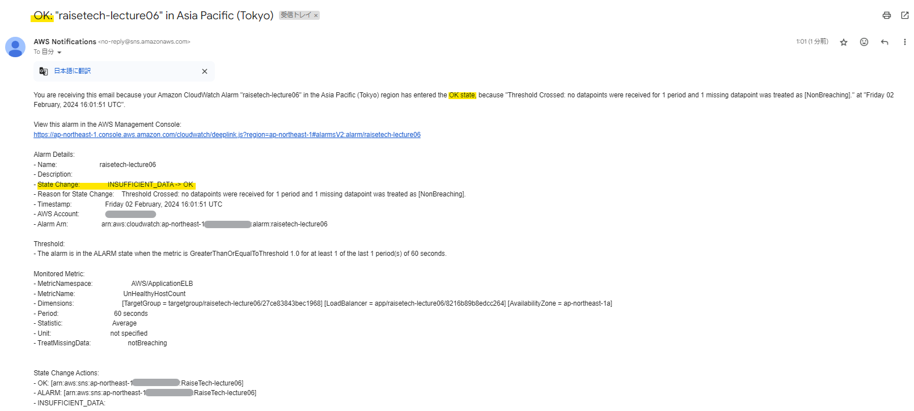

# 第6回授業課題

## 【課題内容】
- 最後にAWSを利用した日の記録をCloudTrailのイベントから探す
  - 自身のIAMユーザー名があるもの
  - イベント名と含まれている内容を3つピックアップ
- CloudWatchアラームを使ってALBのアラーム設定をする
  - Amazon SNSを使用（OKアクションも設定）
  - アラームとアクションを設定した状態での動作確認
- AWS利用料の見積もりを作成
  - これまでに作成したリソースの内容を見積もる
  - 出来たもののURLを共有
- マネジメントコンソールから現在の利用料を確認
  - 先月の請求情報から、EC2の料金がいくらかを確認（free tierとなっているか）
  
 
 

### CloudTrail
***
- 自身のIAMユーザー名で履歴の絞り込みを行った

  

  

- イベントの内容
  - イベント名：LookupEvents
  - イベント時間：2月02,2024,02:53:25 (UTC+09:00)
  - イベントソース：cloudtrail.amazonaws.com
  - イベントID：3b8b75a1-f1cf-4b6e-a51d-a815f1d1406a

 
 

### CloudWatch
***
#### 1. Amazon SNS
- **Amazon Simple Notification Service**

  

 

#### 2. CloudWatch
- 「アラームの作成」で、メトリクス`UnHealthyHostCount`を選択する
- アクションの設定を行う
- 「通知」は、「既存のSNSトピックを選択」にしてAmazon SNSで作成したトピックを通知の送信先に指定する

  

 

〈 **Action：ALARM** 〉

- ターゲットグループのヘルスステータスが**Unhealthy**となっている場合

  

- CloudWatchがアラーム状態となる

  

- ALARMのメールが届く

  

 

〈 **Action：OK** 〉

- ターゲットグループのヘルスステータスが**Healthy**となっている場合

  

- CloudWatchがOK状態となる

  

- OKのメールが届く

  

 
 

### AWS利用料の見積もり
***
- [AWS Pricing Calculator](https://calculator.aws/#/)で見積もりを作成した
  - **[2024/02/02作成見積もり](https://calculator.aws/#/estimate?id=471c3a4d276e9683ac4fd9fec74523d9d9edd68e)**
- 作成した見積もりを共有するためのURLは有効期間が1年間となっている

  

- 今回は1日6時間の利用で、時間が指定できないものに関しては最小単位で設定を行い、見積もりを作成した

  

 
 

### 現在の利用料
***
- 先月の利用料の確認を行った
- 無料利用枠で収まっていることがわかる

  

  

- 使用量の内訳を確認したが、EC2インスタンスとS3しか表示されていなかった

  

- しかし、今回初めて個人的に設定していたアラートがメールにて届いた
  - AWS無料利用枠対象サービスの使用制限の85％を超えているという通知
  - 7日以上課題に取り組めない期間があり、RDSが自動的に再稼働し、設定していた閾値に到達してしまった
  - メールのお陰で、再度RDSを一時停止にして余計なコスト発生のリスクを回避することができた

  

 
 

***
〈参考サイト〉
- [CloudTrail での個人的な調査方法3つ](https://zenn.dev/mn87/articles/b883d98a392472)
- [AWSの料金見積もり方法｜料金計算ツールの使用方法を詳しく紹介](https://www.ashisuto.co.jp/db_blog/article/aws-price-estimate.html)
- [AWS SNS（Amazon SNS）とは？機能の概要、利用上の注意点、料金について解説！](https://and-engineer.com/articles/ZH2RABAAACQAj8ZT)
- [【入門編】Amazon CloudWatchでできることとは？ OSS監視ツールとも比較](https://baresupport.jp/blog/2022/03/08/69/#CloudWatch%E3%81%AE%E6%96%99%E9%87%91)
- [CloudWatchアラームとSNSでメール通知を導入する方法](https://atmarksol.jp/tech/cloudwatch/)
- [CloudWatchアラームで「不足(Insufficient data)」となっている状態を「OK」にする方法](https://dev.classmethod.jp/articles/ok-to-insufficient-data-in-cloudwatch-alarm/)