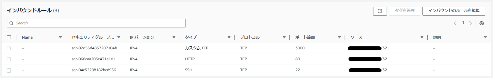

# 第7回授業課題

## 【課題】
- 自身が作った環境において、どのような攻撃に対して「脆弱」であるかの考察と対策

 

### 情報セキュリティにおける3つの要素
***
#### 機密性
特定の人だけがデータにアクセスできるように設定する。外部からの無断アクセスを遮断することで、不正な侵入を防ぎ、悪意のある人間によるサイバー攻撃を回避することが可能。

 

#### 完全性
情報を最新で正しい状態のままキープすること。最新のルールや標準のセキュリティ体制に合わせた環境を構築し、必要に応じてアップデートなどを行うことがセキュリティの安全性を保つことに繋がる。

 

#### 可用性
何らかの障害が発生した場合でも、問題なく情報やデータの保管場所にアクセスできる指標。

 

### 想定されるリスクとアクション
***
#### 1. リスクの要因

| 要因 | 説明 |
|:---|:---|
| 脆弱性 | バグや設定不備によるシステムの「弱点、穴」 |
| 認証情報の流出 | 誤ってGitHubなど公開の場にアップロードした情報を収集している攻撃者が、その情報でログインを試みるケースがある。広義としては脆弱性に含まれる。 |
| 人為的な過負荷 | DoS攻撃、DDoS攻撃など |
 
 

#### 2. 対応方針（アクション）

| アクション | 説明 |
|:---|:---|
| 受容 | 認知はしておくがそのまま受け入れる。何も対策は行わない。 |
| 低減 | 暗号化するなど影響を減らすような対策を行う。 |
| 移転（転嫁） | そもそものリスク管理を当事者以外（外注等）に任せる。 |
| 回避 | リスク自体を発生させないようにする。 |

 

### 課題で構築した環境におけるセキュリティ対策
***
#### 1. アクセスコントロール

EC2のセキュリティーグループで、通信を許可する送信元IPアドレスやプロトコルを設定する。

第4回～第6回の課題で使用している環境では、都合上22番・80番・3000番のポートを開放しているが、いずれも外部（自分以外）のアクセスを許可する必要性がないため、ソースをマイIPアドレスに設定している。`0.0.0.0/0`にしている場合は「すべての通信」ということになり、ポートを全開にしているわけではないが誰でもアクセスが出来るようになってしまう。

 

#### 2. 認証方法の漏洩

GitHubなど公の場に誤って重要な情報を掲載してしまわない為にも、「公開しても問題のない範囲」を認識しておくことは非常に大切であると考える。たとえば画像を投稿する際、個人情報が含まれないようにする、もしくはやむを得ない理由があり含まれているのであれば、情報を隠す等、注意を払って対応をする必要がある。

また、すでに設定しているが、2つ目のログイン認証要素としてMFA（多要素認証）の設定は必須と言える【IAMのベストプラクティス】。仮にIDとパスワードが漏洩した場合でも、二段階認証によりMFAコードがなければログインが出来ないようになるため、アカウントを保護することができる。

 

#### 3. セキュリティパッチの適用

サーバーやアプリケーションのパッチを正しく適用する必要がある。標的型攻撃の対象にされるとOSやアプリケーションのセキュリティホールが狙われるため、セキュリティに関する情報には気を配り、パッチは確実に適用するべきであると言える。パッチの適用によるシステムへの影響が心配であれば、検証用のサーバーをもう1台立ち上げて、十分なテストを行えば良い。

GitHub Dependabotを活用すれば、リポジトリ内の依存関係をチェックし、必要に応じてアラートの通知や、更新の候補をプルリクエストとして発行してくれる。ただし、モジュールの提案しかしてくれない。

 

#### 4. 適切な設定の管理

たとえばAmazon S3において、誰でもアクセスが可能な状態にしないよう、適切なアクセス権限を行って、S3へのアクセスがどうしても必要となるユーザーのみにアクセス権を付与するようにしなければならない【最小限の権限】。S3バケットへのアクセス権限を付与する場合は、読み込み・書き込みの各権限も意識することが大切になる。

 

#### 5. AWSサービスの利用

| サービス | 説明 |
|:---|:---|
| CodeGuru Reviewer | Amazon CodeGuruの機能のひとつで、AIを用いてGitHub等のリポジトリにあるコードをスキャンし、改善を提案してくれるもの。 Java・JavaScript・Pythonしか対応していない。 |
| AWS WAF | Webアプリケーションへの不正なWeb攻撃を防ぐために開発された専用防御ツール。専用装置で導入が必要だったものを仮想化し、導入障壁を下げたもの。 ルールをELBまたはCloudFrontに設置することで、クライアントのアクセスを必ずWAFが評価するようになる。 アカウントの乗っ取り防止などに役立てられ、マネージドルールがあるため導入も簡単なのが特徴。 ※WAFはすべての攻撃を遮断してくれるわけではない ※アプリケーション側での防護策の実施も必須 |
| AWS Certificate Manager | 通信経路を暗号化するためのSSL証明書を発行するたマネージドサービス。 HTTPS（SSL）通信を経由するように設定を行う必要がある。 | △：自身しかアクセス出来ないようにしているため |
| Amazon Inspector | 脆弱性のスキャンを行うサービス。 EC2とECRのスキャンに対応している。 |
| AWS Patch Manager | AWS System Managerの一機能で、EC2に対するOSパッチの適用を自動化できるマネージドサービス。 WindowsOS、LinuxOSのどちらにも対応しており、パッチの区分や重要度に応じて適用可否を制御する機能も有している。 |
| AWS Security Hub | AWSの設定情報を検索して、脆弱な部分を指摘してくれたり、特定の業界基準に準拠しているかを確認してくれる。 利用者はこの指摘を元に、考慮漏れしていた部分の設定を見直すことができる。 |
| AWS Key Management Service | 暗号鍵マネージドサービス。 暗号鍵を自分で用意しなくても良いというのが特長。 |
| Secrets Manager | 秘匿しなければいけない情報をKMSで暗号化して安全に保管、呼び出しするサービス。 RDSのみDBパスワードの定期変更が出来る。 |
| AWS Shield | DDoS攻撃からインフラを保護してくれるマネージドサービス。DDoS攻撃と思われる通信を自動で遮断してくれる。 Shield Standardは無料でAWSアカウントに適用されている。 Shield Advancedは超高額。 |
| IAM Access Analyzer | 各種ポリシーのチェックを行い、大きな権限を与えていないかを確認してくれる。 S3、IAMロール、KMS、Lambda、SQS、Secrets Managerでのみ対応。 |
| Amazon GuardDuty | AWS内のイベントをチェックし、セキュリティインシデントの疑いがあるイベントについて指摘してくれる。 オプションでS3のイベントをチェックすることもできる。 |
| AWS Firewall Manager | セキュリティや設定を一元管理できるサービス。セキュリティポリシーを自動適用したり、ファイアウォールルールを一貫して全てのサービスに適用したりできる。アカウントは複数でも設定可能。 |
| Amazon Macie | S3バケットに保管された個人情報などの機密サービスを自動的に発見し、通知や保護処理を実行することができる。 |
| Amazon Detective | AWS上のアプリケーションでのセキュリティ問題や不審なアクティビティなどがあった際に原因を分析・調査することを支援するサービス。 |

 

**etc.**

 

上記の中で導入がしやすいと感じるのは、AWS WAFとAWS Shield Standardである。AWS WAFは無料利用枠の中に含まれており、AWSManagedRulesCommonRuleSetでOWASP Top 10がサポートされている。AWS Shieldは、Advancedは非常に高額（約40万/月）だが、Standardは無料で適用されている。初学者にとって、コストがかからないものは総じて導入がしやすい。

Amazon Inspectorは15日間の無料トライアル期間があるため、試しに脆弱性のスキャンを行うのも良い。構築している環境が非常に小規模であるため、他のサービスは現状あまり必要がないように感じる。

業務で構築する環境において、その規模が大きく、複雑になればなるほど、AWSのサービスは非常に有効であると感じた。効率良く進められるのはもちろん、結果的にコストを削減することに繋がる場合もあるのだと思う（人件費等）。ただ、あまりにもサービスが多く、なにが適切なのかを見極めるのがかなり難しいと感じた。少しずつサービスへの理解を深めていきたい。

 

***
〈参考サイト〉
- [AWSを使うなら意識すべきセキュリティ対策](https://business.ntt-east.co.jp/content/cloudsolution/column-05.html)
- [AWSネットワークを構築するには？必要な要素と手順・セキュリティ対策を解説](https://business.ntt-east.co.jp/content/cloudsolution/column-11.html#section-18)
- [セキュリティシステムとは？特徴とメリットも紹介](https://www.cloud-for-all.com/azure/blog/what-is-security-system)
- [【AWS Patch Manager】OSパッチ適用を自動化しよう](https://devlog.arksystems.co.jp/2023/04/13/18013/)
- [【初心者向け】Amazon Macieとは](https://www.sunnycloud.jp/column/20220328-01/)