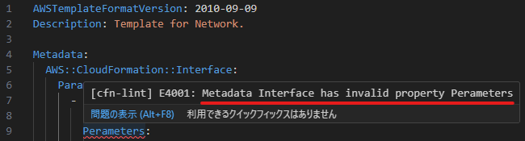
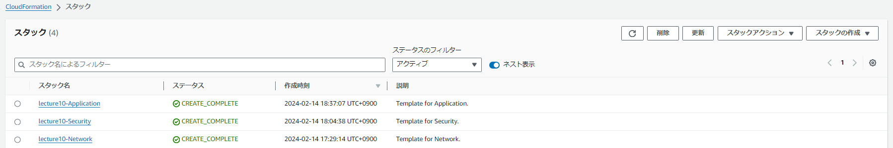
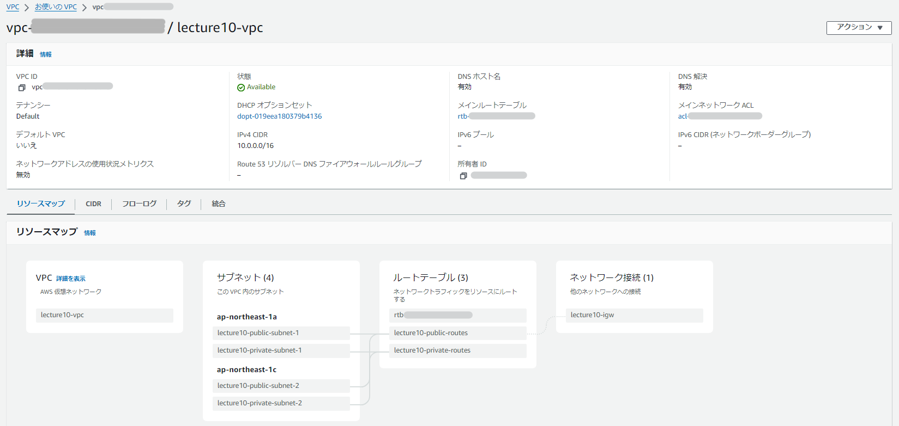

# 第10回授業課題

## 【課題】
- 現在までに作った環境のコード化
  - EC2
  - RDS
  - ALB
  - S3
- コード化したものを実行し、環境が自動で構築されることを確認

 

## CloudFormation
- 課題開始当初、VPC・EC2・RDS…と個別にテンプレートの作成を行おうと思っていたが、スタックを細分化しすぎると他のスタックとの依存関係で修正がしにくくなるという記事を見つけ、最終的にNetwork Layer・Security Layer・Application Layerの3つに分けてテンプレートの作成をすることにした。
- 第5回授業課題で作成した構成図を元に自動化する。

 

| № | Template | 記述内容 |
|:---|:---|:---|
| 1. | [Network](Template/lecture10-Network.yml) | VPC Subnet Route Table Internet Gateway |
| 2. | [Security](Template/lecture10-Security.yml) | Security Group 　- EC2 　- RDS 　- ALB IAM Role 　- AmazonS3FullAccess  |
| 3. | [Application](Template/lecture10-Application.yml) | EC2 RDS ELB (ALB) S3 |
  

 

### 1. Network Layer
***
- Subnet
  - マルチAZ構成
    - PublicSubnet1：10.0.0.0/20
    - PublicSubnet2：10.0.16.0/20
    - PrivateSubnet1：10.0.128.0/20
    - PrivateSubnet2：10.0.144.0/20
- Availability Zone
  - 指定されたリージョンで使用可能なAvailabilityZoneの配列を返す
- Internet Gateway
  - PublicSubnet1・PublicSubnet2のみアタッチ

 

- 「スタックの作成」をしようとした際、`invalid template resource property 'properties'`等のエラーが表示され、次の工程に進むことが出来なかった。テンプレートの記述内容を何度も見直したが自力での解決が難しかった為、下記サイトを参考にVSCodeの拡張機能である**cfn-lint**の導入を行った。

  ▶ [Windows環境のVSCodeでcfn-lintを使えるようにする手順。](https://qiita.com/kmmz/items/415af7c9270302d600f5)

- するとエラーの内容が表示されるようになった。下図では`メタデータ・インターフェースに無効なプロパティ Perameters があります`というコメントが表示され、確認すると`Parameters`の綴りが間違っていることがわかる。

- エラーがあればファイル名が赤字になり、エラー個数が表示されるため視覚的にもわかりやすい。

- 今回、AvailabilityZoneで直接リージョンの指定をしようと試みたが、`Don't hardcode ap-northeast-1a for AvailabilityZones (AvailabilityZonesにap-northeast-1aをハードコードしないでください)`とcfn-lintのコメントが表示された為、別の方法でリージョンの指定を行った。

 

### 2. Security Layer
***
- Security Group
  - EC2
    - 第5回授業課題で使用したポートをあらかじめ解放
    - `# HTTP (ALB)`ではCIDR IPとして`lecture10-alb-sg`を指定
    - その他CIDR IPでは`MyIP`を指定

  - RDS
    - `# MYSQL/Aurora`ではCIDR IPとして`lecture10-ec2-sg`を指定
  - ELB (ALB)
    - CIDR IPでは`MyIP`を指定

- IAM Role
  - AmazonS3FullAccess
  - EC2インスタンスにロールを付与できるように設定

 

- 組み込み関数`Fn::Join`の記述が個人的に難しかった。またcfn-lintは、記述方法が間違っているかどうかの判別はつくが、**組み込み関数の内容（スタックを跨いだ紐付け）が正しいかどうかは判別ができない**ため注意が必要。

 

### 3. Application Layer
***
- EC2
  - `ImageId`は確実に無料利用枠を選択したい為、今回は最新版を取得する記述ではなく直接AMI IDを指定

 

- RDS（表にて記述）

| 項目 | 説明 |
|:---|:---|
| Multi AZ | 第5回授業課題の構成図ではマルチAZ構成にしているが、そもそも無料利用枠ではマルチAZ構成には出来ないため`false`に設定（構成図の作成ミス） |
| Storage Type / Allocated Storage（ストレージタイプ / ストレージ割り当て） | 最小値にて設定 |
| Storage Encrypted（暗号化） | `t2.micro`では暗号化を使用できない |
| Max Allocated Storage（ストレージの自動スケーリング） | 数値を指定してしまうと有効になってしまうためそもそも記述をしない |
| DB Name（最初のデータベース名） | 第4回授業課題でRDSを作成した際、空欄のままにしていたため今回は設定しない |
| Master User Name / Master User Password | AWS Secrets Managerを活用することも考えたが、課題でRDSを作成した際は使用していないためNoEcho属性を`true`で指定 |
| その他 | 課題では環境を構築するだけのため、自動バックアップとスナップショットの作成はあえて無効化 UpdateReplacePolicy属性も`Delete`に設定 |

 

- ELB (ALB)
  - Resource Type
    - `AWS::ElasticLoadBalancing::LoadBalancer`はCLB (Classic Load Balancer) を指定するリソースタイプ
    - 上記ではなく`AWS::ElasticLoadBalancingV2::LoadBalancer`を記述する
  - Subnets / Subnet Mappings
    - `Subnets`と`SubnetMappings`を両方指定することはできない
    - 上記の違いは、Elastic IPアドレスの指定ができるかどうか
      - `SubnetMappings`＝Elastic IPアドレスの指定が可能

 

- S3
  - 無効化したもの
    - パブリックアクセス
    - バージョニング
    - ACL設定

 

### スタックの作成
***
- エラーが出た箇所
  - **lecture10-Security.yml**
    - CIDR IP
      - 誤って`!Sub`を使用していた
      - パラメータを入力する際、`/32`が抜けていた
      - `CidrIp`で別のセキュリティーグループを指定していた
  - **lecture10-Application.yml**
    - S3
      - `lecture10-s3-bucket`はすでに存在しているというエラーが出ていたが、確認してもS3のバケットは存在せず、原因が不明だったためバケット名を`lecture10-s3`に変更

 

- 上記の修正を行い、スタックの作成に成功した

 

### 作成結果
***
#### Network Layer
- VPC

 

#### Security Layer
- EC2

- RDS

- ALB

- IAM

 

#### Application Layer
- EC2

- RDS

- ALB

- S3

 

***
〈参考サイト〉　★ ＝ AWS公式サイト
- **Network**
  - [AWS CloudFormation VPC テンプレート](https://docs.aws.amazon.com/ja_jp/codebuild/latest/userguide/cloudformation-vpc-template.html) ★
  - [テンプレートリファレンス](https://docs.aws.amazon.com/ja_jp/AWSCloudFormation/latest/UserGuide/template-reference.html) ★
  - [【AWS】CloudFormationをご紹介！](https://smallit.co.jp/blog/a1180/)
  - [【初心者向け】AWS CloudFormation で VPC を構築する](https://staff-blog.faith-sol-tech.com/%E3%80%90%E5%88%9D%E5%BF%83%E8%80%85%E5%90%91%E3%81%91%E3%80%91aws-cloudformation-%E3%81%A7-vpc-%E3%82%92%E6%A7%8B%E7%AF%89%E3%81%99%E3%82%8B/#toc5)
  - [CloudFormationを使ってVPCを構築する](https://qiita.com/okubot55/items/b18a5dd5166f1ec2696c)
  - [AWS CloudFormationでVPCと複数AZにサブネットを構築する](https://qiita.com/takasho9321/items/1e1fb4d0ffaae2505d0e)
  - [【AWS】 CloudFormationで基本的なシングル構成を自動構築する](https://zenn.dev/megazone_japan/articles/ad61f0dbc6e37f)
  - [【AWS】CloudFormationで、定番のネットワーク構成を作成してみた](https://zenn.dev/anaka/articles/627d0a112d57ed)
  - [【図解AWS】ルートテーブルとは？初心者にもわかりやすく解説！](https://en-junior.com/routetable/)
  - [【AWS】ルートテーブルでよく使われる設定を分かりやすくざっと解説【中級の壁】](https://www.isoroot.jp/blog/4559/)
  - [個人的 CloudFormation ベストプラクティスまとめ](https://qiita.com/hirai-11/items/62a4fea74cc6188cf8e9)
  - [【初心者必見】はじめてのAWS CloudFormation](https://www.ctc-g.co.jp/solutions/cloud/column/article/07.html)
  - [あなたもできる！ CloudFormationテンプレートセッションまとめ ( 1 )](https://dev.classmethod.jp/articles/lim-cfn-session-1-js/)
  - [【AWS】CloudFormationを使ってみよう](https://devlog.arksystems.co.jp/2022/11/15/18032/)
  - [CloudFormationのテンプレートを分割して作成してみた。](https://qiita.com/Takao_/items/8384110f259b31abdc1b#network-layer)
  - [【AWS初学者向け・図解】CloudFormationの組み込み関数を現役エンジニアがわかりやすく解説①](https://o2mamiblog.com/aws-cloudformation-intrinsic-function-beginner-1/)
  - [[CloudFormation] Metadata セクションで入力パラメータを見やすく設定する](https://zenn.dev/ano/articles/c5eedcc31b30e2)
  - [CloudFormationをゼロから勉強する。（その６：Transformによるインクルード）](https://qiita.com/sakai00kou/items/57019ef4b3b6b7d61251)
  - [CloudFormationのParametersの入力方法の違いをデータ型ごとに一覧にしてみた](https://dev.classmethod.jp/articles/list-of-cloudformation-parameters-by-data-type/)

- **SecurityGroup**
  - [AWS CloudFormation 活用 (セキュリティグループ編)](https://engineers.weddingpark.co.jp/aws-cloudformation-%E6%B4%BB%E7%94%A8-%E3%82%BB%E3%82%AD%E3%83%A5%E3%83%AA%E3%83%86%E3%82%A3%E3%82%AF%E3%82%99%E3%83%AB%E3%83%BC%E3%83%95%E3%82%9A%E7%B7%A8/)
  - [CloudFormationによる【セキュリティグル ープ】の構築](https://cloud5.jp/cf-sg/)
  - [AWS CloudFormationを用いたリソース構築](https://blog.logical.co.jp/entry/2023/04/20/173000#%E3%82%BB%E3%82%AD%E3%83%A5%E3%83%AA%E3%83%86%E3%82%A3%E3%82%B0%E3%83%AB%E3%83%BC%E3%83%97)
  - [IAMインスタンスプロファイルって？](https://zenn.dev/yuta28/articles/ec2-iam-instance-profile)
  - [CloudFormationでEC2にIAMロールを付与する](https://qiita.com/predora005/items/480dc3db258e84fcee81)
  - [【AWS CloudFormation】ロール作成を通してポリシーとロールの関係を理解する](https://qiita.com/ktamido/items/d7da6401784110dff739)
  - [Amazon S3のアクセスに必要な最低限のIAMポリシーの設定](https://www.jpcyber.com/support/minimal-iam-policy-to-access-amazon-s3)
  - [CloudFormation の組み込み関数 Fn::Sub 対 Fn::Join](https://dev.classmethod.jp/articles/cloudformation-fnsub-vs-fnjoin/)
  - [[小ネタ] CloudFormationの組み込み関数を使った文字列操作の備忘録](https://dev.classmethod.jp/articles/cloud%E2%80%8Bformation-intrinsic-function-memorandum/)

- **Application**
  - [CloudFormation による動的サイトの構築自動化](https://hackmd.io/@XPx55BOdQVm_Flkoze74_A/ByEmGFtXH#52-%E3%82%BB%E3%82%AD%E3%83%A5%E3%83%AA%E3%83%86%E3%82%A3%E3%82%B0%E3%83%AB%E3%83%BC%E3%83%97%E3%83%86%E3%83%B3%E3%83%97%E3%83%AC%E3%83%BC%E3%83%88%E3%81%AE%E4%BD%9C%E6%88%90)
  - [AWS CloudFormationでEC2を構築](https://qiita.com/tyoshitake/items/c5176c0ef4de8d7cf5d8)
  - [AWS CloudFormation で EC2 を構築してみよう](https://aws.taf-jp.com/blog/72288#AWS_CloudFormation_%E3%81%A7_EC2_%E3%82%92%E6%A7%8B%E7%AF%89%E3%81%97%E3%81%A6%E3%81%BF%E3%82%88%E3%81%86)
  - [CloudFormationによる【RDS】の構築](https://cloud5.jp/cf-rds/)
  - [CloudFormationを使ってMySQLのRDSを構築する](https://qiita.com/okubot55/items/87d4bd7a3649992bc5f7)
  - [【AWS】 CloudFormationで基本的な構成のEC2とRDSを作る](https://qiita.com/kobayashi_0226/items/d0f49dbe84937de73a4d)
  - [CloudFormationでRDS for MySQLの自動スケーリングを有効にしてみる](https://dev.classmethod.jp/articles/rds_autoscaling_cfn/)
  - [CloudFormationテンプレートに秘密情報を渡す方法
インフラ CloudFormation](https://techblog.zozo.com/entry/pass_secrets_to_cloudformation)
  - [CloudFormationでRDSのセキュアな構築](https://qiita.com/AwsEngineer-kagoshima/items/b0501da63d002aa9c3f8)
  - [CloudFormation NoEchoとは](https://qiita.com/kazunobu2211/items/76a3a6f30d2a7493fc2b)
  - [CloudFormationテンプレートのパラメータ](https://oreout.hatenablog.com/entry/aws/cloudformation/2)
  - [手動で作成したAWSリソースをCloudFormation管理下に置く](https://qiita.com/chore/items/15287873fbf97081e492)
  - [AWS RDS MySQLインスタンスの作成](https://qiita.com/miriwo/items/e89c1d5eaa2c6468f772)
  - [CloudFormationによる【ALB】の構築](https://cloud5.jp/cf-alb/)
  - [[CloudFormation] テスト用 web サーバと ALB を作成](https://zenn.dev/ano/articles/476e95b3c91164)
  - [CloudFormationでハマった](https://qiita.com/y-ohgi/items/63f5079a3352026ea23a)
  - [[アップデート]注目はELBv2のListener！AWS CloudFormationのサポートするリソースが追加されました](https://dev.classmethod.jp/articles/aws-cloudformation-update-support-resource-and-using-elbv2-listener/)
  - [【CloudFormation】S3をデプロイしてみる](https://zenn.dev/part_of_mitsuo/articles/20220627-cloudformation01)
  - [はじめてのAWS CloudFormation -S3バケット作成編-](https://qiita.com/Mouflon_127000/items/6731e5c5d793341a8906)
  - [【AWS】利用料金発生に怯えるあなたへ](https://qiita.com/priseday/items/aa4da08cba4319b42042)